# 👋 Hi, I'm Vaibhav

 

## 🧠 About Me

- 🎓 Aspiring **AI/ML Engineer** with a strong interest in Machine Learning and Data Science
- 💻 Working with **Python, C++, and Machine Learning frameworks**
- 🤖 Exploring **Generative AI, Transformers, Computer Vision, and Deep Learning**
- 📊 Interested in building practical, data-driven AI systems
- 🚀 Always learning, experimenting, and building new projects

 

## 🛠️ Tech Stack

 

## 📊 GitHub Stats

  

  

 

## 📈 Contribution Graph

 

## 🐍 Contributions

 

## 🏆 GitHub Trophies

 

## 🤝 Connect With Me

 

## ✍️ Random Dev Quote

 

 

